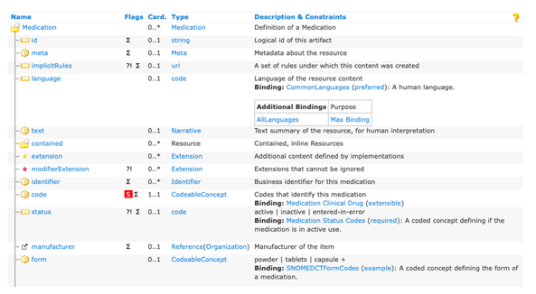
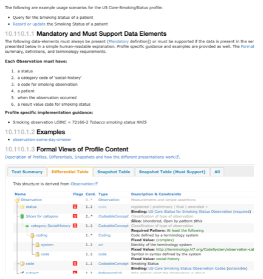

# Part 3: Implementation Guides and US Core

## Background on FHIR®
**The HL7® FHIR® (Fast Healthcare Interoperability Resources) standard defines both the method and structure for HOW healthcare information can be exchanged between different systems regardless of how it is stored in those systems.**

It allows healthcare information, including clinical and administrative data, 
to be available securely to those who have a need to access it, and to those who have the right to do so for the benefit of a patient receiving care. 

The FHIR® standard is developed and maintained by the (Health Level Seven®)  HL7® organization.

??? Abstract "More about FHIR®"
    HL7 FHIR is a robust and comprehensive standard, but for the purposes of this tutorial here is a very simplified view.
   
    * FHIR defines a set of **Resources** that can be exchanged.
   
    * These Resources are structured data building blocks that group together commonly used and related data fields.
   
    * Examples of Resources are things like `Patient`, `Encounter`, `Condition`, `AllergyIntolerance`, `Medication`, `Procedure`, and `Observation`. Some of these concepts should be familiar from Part 1. FHIR defines over 140 resources.
   
    * FHIR also defines an **Application Programming Interface (API)*** which is a way for applications to programmatically query and request data Resource by Resource.
   
    * While FHIR defines these Resources and API, it also specifies that a large majority of the features are optional.
   
    * A lot of optionality can be a good thing, but with exchanging health data for a particular use-case, that optionality and flexibility allows for too much ambiguity and differences. Therefore, the FHIR community also develops **Implementation Guides** to specify exactly how FHIR should be used for many real-world use-cases.

> More information and an overview can be found here: [https://www.healthit.gov/sites/default/files/2019-08/ONCFHIRFSWhatIsFHIR.pdf](https://www.healthit.gov/sites/default/files/2019-08/ONCFHIRFSWhatIsFHIR.pdf)

!!! note "Additional Information Available"
    * Please note, NIH has created a webinar and associated interactive workshop focused specifically on the FHIR® standard.  
        * Webinar: [https://www.youtube.com/watch?v=_ZwQW0BJJx0](https://www.youtube.com/watch?v=_ZwQW0BJJx0)
        * Workshop in Python: [https://www.youtube.com/watch?v=yGT3ottE7LY](https://www.youtube.com/watch?v=yGT3ottE7LY)
        * Workshop in R: [https://www.youtube.com/watch?v=TpjueS9L-5o](https://www.youtube.com/watch?v=TpjueS9L-5o)
        * Link to github exercises: [https://github.com/mitre/fhir-exercises](https://github.com/mitre/fhir-exercises)


## How Implementation Guides (IG) are developed

### Introducing Implementation Guides
A principal challenge for healthcare standards is how to handle the wide variability caused by diverse healthcare processes. Over time, more fields and optionality are added to the specification, gradually adding cost and complexity to the resulting implementations. The alternative is relying on custom extensions, but these create many implementation problems too.

FHIR® solves this challenge by **defining a simple framework for extending the existing resources to encompass new information** and describe their use with Profiles. All systems that are FHIR-enabled can read all resources provided in a data exchange, but applications can add more control and meaning using profiles. 

Many healthcare contexts therefore require extensive local agreements.

!!! note "How FHIR® Adapts to the Diverse Array of Healthcare Data Requirements"
    By its nature, FHIR® is designed to be both as comprehensive and expandable as possible to cover the widest range of health-related modalities. Its extensibility is a critical enabler for bringing in the widest possible array of potential use-cases and stakeholders into an interoperable health IT framework.

The result of this, however, is that the potential exists for two health IT systems, **even when both are on the FHIR® standard, to have vastly divergent sets of information available.** Because of this, there exists a need for FHIR® standard guidelines that define the precise implementations of FHIR® a specific health IT system has deployed and supports. These guides have been formalized in FHIR® as **Implementations Guides (IG)**.

>An IG is a set of rules about how FHIR® resources are used (or should be used) to solve a particular problem, with associated documentation to support and clarify the usage.

FHIR® IGs are typically published on the web after they are generated.

??? note "For more information on the general process for IG creation, continue here"
    * FHIR® has a specific process for publishing IG available here: [https://confluence.hl7.org/display/FHIR/IG+Publisher+Documentation](https://confluence.hl7.org/display/FHIR/IG+Publisher+Documentation)

    * FHIR® also includes the `ImplementationGuide` resource: a single resource that defines the logical content of the IG, along with the important entry pages into the publication, so that the logical package that the IG represents, so that the contents are computable. 

    * In particular, validators are able to use the `CapabilityStatement` resource to validate content against the IG as a whole. The capability statement is a key part of the overall conformance framework in FHIR. It is used as a statement of the features of actual software, or of a set of rules for an application to provide. This statement connects to all the detailed statements of functionality, such as StructureDefinitions and ValueSets. This composite statement of application capability may be used for system compatibility testing, code generation, or as the basis for a conformance assessment. For further information about Conformance testing, see Conformance Rules and Profiling FHIR.
    More on this resource here: [https://build.fhir.org/capabilitystatement.html](https://build.fhir.org/capabilitystatement.html) 

It should also be noted that while individual organizations and entities can develop their own IG, the development process should also be guided and supported by the HL7 community.

## US Core 
So, if there are a variety of IGs available for FHIR® implementation, is there a particular one that maps to the USCDI data standard, one whose adoption would ensure that an EHR system fully met Promoting Interoperability guidelines?

> Yes! The US Core IG does exactly that.

The US Core IG is based on FHIR® Version R4 
> Link for further info on FHIR® Version R4 Summary – FHIR® v4.0.1: [https://www.hl7.org/fhir/summary.html](https://www.hl7.org/fhir/summary.html) 

>The US Core IG defines the **minimum set of constraints on the FHIR® resources** to create the US Core Profiles. It also defines the **minimum set of FHIR® RESTful interactions** for each of the US Core Profiles to access patient data. By establishing the **“floor”** of standards to promote interoperability and adoption through common implementation, it allows for further standards development evolution for specific uses cases. 

### Specifics of the US Core IG including relationship to USCDI

Let’s take a closer look at how USCDI maps to US Core. The following table maps the relationship between the **USCDI v1 Summary of Data Classes and Data Elements**, it’s corresponding **US Core Profile**, and finally the associated **FHIR® Resource**. We can see the first few examples here:


The complete table is available here:
[https://www.hl7.org/fhir/us/core/general-guidance.html](https://www.hl7.org/fhir/us/core/general-guidance.html)

### Requirements and elements to be US Core compliant
The complete list of **US Core Profiles** is below. Each profile defines the minimum mandatory elements, extensions and terminology requirements that **MUST** be present to satisfy that profile. 

For each profile, requirements and guidance are given in a simple narrative summary.
??? Note "Complete list of US Core Profiles"
    * US Core AllergyIntolerance Profile
    * US Core BMI Profile
    * US Core Blood Pressure Profile
    * US Core Body Height Profile
    * US Core Body Temperature Profile
    * US Core Body Weight Profile
    * US Core CarePlan Profile
    * US Core CareTeam Profile
    * US Core Condition Profile
    * US Core DiagnosticReport Profile for Laboratory Results Reporting
    * US Core DiagnosticReport Profile for Report and Note exchange
    * US Core DocumentReference Profile
    * US Core Encounter Profile
    * US Core Goal Profile
    * US Core Head Circumference Profile
    * US Core Heart Rate Profile
    * US Core Immunization Profile
    * US Core Implantable Device Profile
    * US Core Laboratory Result Observation Profile
    * US Core Location Profile
    * US Core Medication Profile
    * US Core MedicationRequest Profile
    * US Core Organization Profile
    * US Core Patient Profile
    * US Core Pediatric BMI for Age Observation Profile
    * US Core Pediatric Head Occipital-frontal Circumference Percentile Profile
    * US Core Pediatric Weight for Height Observation Profile
    * US Core Practitioner Profile
    * US Core PractitionerRole Profile
    * US Core Procedure Profile
    * US Core Provenance Profile
    * US Core Pulse Oximetry Profile
    * US Core Respiratory Rate Profile
    * **US Core Smoking Status Observation Profile**
    * US Core Vital Signs Profile

Looking at the complete list of US Core Profiles one might notice that **SMOKING STATUS** again! It was in the EHR data we saw, and it was in the USCDI criteria... we’ll revisit this example soon...

### IG navigation example by detailed US Core walkthrough

Let’s look specifically at the US Core Medication Profile here.


We can see details of the elements of the medication profile: [http://build.fhir.org/ig/HL7/US-Core/StructureDefinition-us-core-medication.html](http://build.fhir.org/ig/HL7/US-Core/StructureDefinition-us-core-medication.html)

??? question "Knowledge Check: Which element(s) of this profile must be supported in order to be US Core Compliant?"
    `Medication.code` element

Going back to our **smoking example** take a look here: [http://hl7.org/fhir/us/core/STU5/StructureDefinition-us-core-smokingstatus.html#mandatory-and-must-support-data-elements](http://hl7.org/fhir/us/core/STU5/StructureDefinition-us-core-smokingstatus.html#mandatory-and-must-support-data-elements)



We can see here a list of required elements this profile must support.

??? question "Knowledge Check: How many elements are required and what are they?"
    7 required elements. They include a `status`, a category slice, and then a specific category code of `social-history`, a code for smoking observation, a patient, when the observation occurred, a result value code for smoking status

??? question "Knowledge Check: Where would I find the reference ID of the patient?"
    `Subject code`

Let’s take a look at the raw unformatted **JSON code** for the resource:

??? note "Sample JSON code of the Smoking Resource"
    ```JSON
    {
    "resourceType": "Observation",
    "id": "056f4fe8-cd0a-db01-9d8b-0b3bf098368c",
    "meta": {
        "profile": [ "http://hl7.org/fhir/us/core/StructureDefinition/us-core-smokingstatus" ]
    },
    "status": "final",
    "category": [{
        "coding": [{
            "system": "http://terminology.hl7.org/CodeSystem/observation-category",
            "code": "social-history",
            "display": "social-history"
        }]
    }],
    "code": {
        "coding": [{
        "system": "http://loinc.org",
        "code": "72166-2",
        "display": "Tobacco smoking status NHIS"
        }],
        "text": "Tobacco smoking status NHIS"
    },
    "subject": { "reference": "urn:uuid:c37a6b5c-a13c-835d-bfe2-e215df91cb3c" },
    "encounter": { "reference": "urn:uuid:0f7f8554-0896-65dd-7bed-fe85762791dd" },
    "effectiveDateTime": "2012-07-25T10:07:28-04:00",
    "issued": "2012-07-25T10:07:28.029-04:00",
    "valueCodeableConcept": {
        "coding": [{
        "system": "http://snomed.info/sct",
        "code": "266919005",
        "display": "Never smoker"
        }],
        "text": "Never smoker"
    }
    }
    ```
Check out this patient profile here: HL7.FHIR.US.CORE\Some Day Smoker Example - JSON Representation [http://hl7.org/fhir/us/core/STU5/Observation-some-day-smoker.json.html](http://hl7.org/fhir/us/core/STU5/Observation-some-day-smoker.json.html)

Link here: [http://build.fhir.org/ig/HL7/US-Core/StructureDefinition-us-core-smokingstatus.html](http://build.fhir.org/ig/HL7/US-Core/StructureDefinition-us-core-smokingstatus.html)

??? question "Knowledge Check: When was this observation taken?"
    July 25, 2012
??? question "Knowledge Check: Is she a smoker and if so, what kind?"
    Never smoker

!!! check "Additional Resources:"
    * Video from the HL7 FHIR® Connectathon features hands-on FHIR® development and testing. Implementers and developers can gain hands-on experience developing FHIR-based solutions by participating in one of many tracks. [https://vimeo.com/542197402/8fb80fea04](https://vimeo.com/542197402/8fb80fea04)

!!! check "Key Point: Why this matters:"
    **Researchers accessing data through the FHIR® standard are almost guaranteed to encounter novel implementations based on the particulars of the system they are accessing. The US Core IG, however, serves as a baseline researchers will be able to depend on for United States-based EHR data. Familiarity with the US Core IG provides a foundational grasp of available data.**