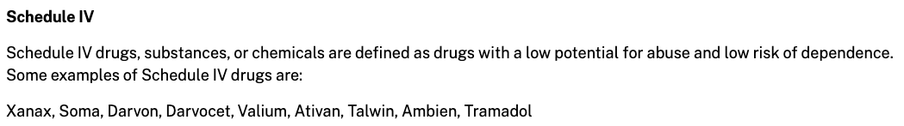

## Learning Objectives and Key Concepts

Workshop attendees will learn how to:
* Query a FHIR Server to learn about its capabilities
* How to read FHIR specifications and understand how it applies to FHIR interactions and data
* Search for resources of various types and parse the results to find information of interest
* Process paginated responses
* Understanding FHIR Resources to find data of interest
* Exploring MedicationRequest
* Integrate other, non-FHIR based APIs

## Icons in this Guide

📘A link to a useful external reference related to the section the icon appears in

## Introduction

This notebook explores a FHIR server with a RESTful API which contains data with patients currently prescribed opioids. We'll explore the FHIR Server to learn about its capabilities, query for FHIR resources, and generate some basic visualizations from the data.

## Initial setup

First, let's configure the environment with the libraries and settings that will be used throughout the rest of the exercise.

```{r setup}
library(fhircrackr)
library(tidyverse)
library(skimr)
library(summarytools)

# Used for direct RESTful queries against the FHIR server
library(httr)
library(jsonlite)

library(lubridate) # Datetime manipulation

# Visualizations
library(ggthemes)
theme_set(ggthemes::theme_economist_white())
```

### Environment configuration

```{r}
fhir_server <- "https://api.logicahealth.org/opioids/open"
```

## Querying the Server

All servers are required to support the `capabilities` interaction which documents the server's functionality. The capability interaction is of the form:

`GET [base]/metadata`

📘[Read more about the capabilities interaction](https://www.hl7.org/fhir/http.html#capabilities)

`fhircrackr` provides an easy way to query this endpoint and load the results into R:

```{r}
cs <- fhir_capability_statement(fhir_server)
```

The CapabilityStatement is usually a very large resource so we'll focus on a few key elements. Namely, the FHIR version supported, the Resource formats supported, and the endpoint types.

```{r}
str_c("FHIR Version Supported: ", cs$Meta$fhirVersion, "\n") %>% cat
str_c("Formats Supported: ", cs$Meta$format, "\n") %>% cat
str_c("FHIR Resources Supported: ", cs$Resources$type %>% length, "\n") %>% cat
```

We can also see the details of the types of FHIR Resources available on this endpoint and the supported operations. Keep in mind that there might not be any data available for a particular FHIR resource even if the server supports that type.

```{r}
cs$Resources %>% glimpse
```

If you look at the full data frame below, the `interaction.code` column tells you which [FHIR interactions](https://www.hl7.org/fhir/http.html) are supported for a given resource type.

```{r}
cs$Resources
```

## FHIR Resources

We can see that this FHIR server supports a lot of resources, but what resources might we typically expect a FHIR server to support and where can we learn more about them?

The FHIR spec defines a large number of resources. Some of these resources have been widely implemented and have stable structures, while others are merely considered draft. As a standards framework, the FHIR specification itself largely does not require that an implementation support any specific resources.

Implementation Guides, like the US Core Implementation Guide, which reflects the U.S. Core Data for Interoperability (USCDI) illustrate the resources and profiles on those resources that an implementation would be expected to support for most US health data.


📘[Read more about FHIR Resources](https://www.hl7.org/fhir/resourcelist.html)

📘[Read more about FHIR Maturity Levels](https://www.hl7.org/fhir/versions.html#std-process)

📘[Read more about US Core](https://www.hl7.org/fhir/us/core/)

📘[Read more about USCDI](https://www.healthit.gov/isa/sites/isa/files/2020-07/USCDI-Version-1-July-2020-Errata-Final.pdf)


## FHIR Profiles and Data Types

The structure of a FHIR resource is defined by a FHIR `StructureDefinition`. Some of the key things a FHIR `StructureDefinition` defines for a resource includes:

* the elements and the data types of those elements within the FHIR resource
* the `Cardinality`, or minimum and maximum number of times the element may appear in a resource
* any terminology bindings which determine the value sets from which an coded element is expected or required to be from

Profiles within Implementation Guides build off the `StructureDefinitions` within the base FHIR specification to further constrain requirements or add expectations around extensions to support additional information not covered by the base resource profile.


📘[Read more about StructureDefinitions](http://www.hl7.org/fhir/structuredefinition.html)

📘[Read more about Data Types](https://www.hl7.org/fhir/datatypes.html)

📘[Read more about Cardinality](https://www.hl7.org/fhir/conformance-rules.html#cardinality)

📘[Read more about Terminology Bindings](https://www.hl7.org/fhir/terminologies.html)

### Querying the Server

The FHIR Spec has a nice summary cheat sheet which is helpful for crafting queries and understanding the resources they return.


(Source: <https://www.hl7.org/fhir/http.html#summary>)

Now that we know a little bit about the server, let's query for all the patients.

```{r}
request <- fhir_url(url = fhir_server, resource = "Patient")
patient_bundle <- fhir_search(request = request)
```

Note that FHIR servers will typically split responses into ["pages"](http://www.hl7.org/fhir/http.html#paging) to limit the response size. This is important for servers that could have thousands or millions of instances of a given resource.

By default, `fhircrackr` will make a separate request to get the Bundle of FHIR resources contained in each "page" from the server for a given query, and will automatically stitch the results together into a single data frame. However, this can take a _long_ time, so you may wish to set the maximum number of Bundles downloaded by `fhircrackr`, like `fhir_search(request = request, max_bundles = 1)`.

You can also request a certain number of resources in each Bundle with the [`_count` parameter](https://www.hl7.org/fhir/search.html#count).

Once we have our Bundle(s) of Patient resources, we need to define the table description for `fhircrackr` to convert from the FHIR resources into data frames. To understand the structure of the XML, let's look at the second resource returned by the server (using `./entry[2]/resource` as the XPath query to get the 2nd resource instead of `./entry[1]/resource` to get the first resource; the first one is missing some data that the others have):

```{r}
xml2::xml_find_first(x = patient_bundle[[1]], xpath = "./entry[2]/resource") %>%
  paste0 %>%
  cat
```

You can also just print the structure, which can help when constructing XPath queries:

```{r}
xml2::xml_structure(
  xml2::xml_find_first(x = patient_bundle[[1]], xpath = "./entry[2]/resource")
)
```

Each instance of a given resource will be _roughly_ the same (assuming the FHIR server is working properly), so looking at the structure of just one resource typically provides _most_ of the information you'll need to extract the data from _all_ the resources. By incrementing the `[[1]]` to `[[2]]`, etc. in the commands above you can look at additional resource instances.

You may also want to reference the [FHIR specification](https://www.hl7.org/fhir/resourcelist.html) for the resource you're working with (in this case, [Patient](https://www.hl7.org/fhir/patient.html)) to better understand what elements may be available, as well as documentation specific to the server's implementation (which may be found in a [FHIR Implementation Guide](https://www.hl7.org/fhir/implementationguide.html)).

Using this information, we can use these to create the `fhircrackr` "table description":

```{r}
table_desc_patient <- fhir_table_description(
  resource = "Patient",

  cols = c(
    PID           = "id",
    given_name    = "name/given",
    family_name   = "name/family",
    gender        = "gender",
    birthday      = "birthDate",
    maritalStatus = "maritalStatus/coding[1]/code", # Note that marital status is not in the example we printed above - but you can see it may be available
                                                    # by looking at the FHIR spec: https://www.hl7.org/fhir/R4/patient.html
    maritalStatusDisplay = "maritalStatus/coding[1]/display"
  )

)

# Convert to R data frame
df_patient <- fhir_crack(bundles = patient_bundle, design = table_desc_patient, verbose = 0)

df_patient
```

## Patient Demographics

Now that we have all our patients, let's try and analyze their demographics.

First lets find the frequency of gender values:

```{r}
freq(df_patient, gender)
```

Let's also look at the frequency of the marital status codes.

```{r}
freq(df_patient, maritalStatus)
```

`M` and `S` codes are a bit cryptic, so let's check them against the display text and create a cross tabulation of the factors.

```{r}
ctable(df_patient$maritalStatusDisplay, df_patient$maritalStatus)
```
It looks like there may be some data quality issues with this variable -- why does `maritalStatusDisplay` have both `Never Married` and `S` if those equate to the same code of `S`?

Patient age isn't directly available in the data set, but can be calculated via the patient's birthday.

```{r}
df_patient %>%
        mutate(
          # `%--%` creates an interval: https://lubridate.tidyverse.org/reference/interval.html
          # `/ years(1)` converts the interval into a number of years
          age = (lubridate::date(birthday) %--% lubridate::today()) / years(1)
        ) %>%
        ggplot(aes(age)) +
        geom_histogram()

```

## Querying for Resources

FHIR breaks up health information into chunks of data called Resources which are connected together via references.

In this use case we're interested in patients who've been prescribed opioids. Looking at the [FHIR Patient profile](https://www.hl7.org/fhir/patient.html) we see a few references to things like their primary care provider or the organization managing the patient record, but nothing about medications. Luckily, above this profile we see a list of other resources that reference Patient - including [MedicationRequest](https://www.hl7.org/fhir/medicationrequest.html#MedicationRequest). Looking within MedicationRequest we see that `MedicationRequest.subject` identifies the patient the medication is for.

Let's see if we can find the Medications prescribed to the patient with id `10098`. The core FHIR spec doesn't require that any specific searches be supported so it's important to read the documentation and look at the CapabilityStatement of the server being queried to get an idea of the options available. For now we'll look at the core FHIR spec for an idea of search parameters defined in the base spec that servers might implement.

Looking at the MedicationRequest Resource core FHIR documentation it looks like there are two search parameters that would be helpful: `patient` and `subject`. Practically either would work just fine, but looking at the Expression we can see that `patient` only works for references to a Patient resource, while `subject` would work for references to either a Patient or a Group. Looking at the CapabilityStatement, it also appears that the server supports both!

```{r}
(cs$Resources %>% filter(type == "MedicationRequest"))$searchParam.name %>%
  str_replace_all(" \\|\\| ", "\n") %>% cat
```

_Note: Specific FHIR Implementation Guides, like US Core, may define their own SearchParameters for servers to implement_

📘[Read more about FHIR Resource Organization](https://www.hl7.org/fhir/overview-arch.html#organizing)

Let's request the MedicationRequest resources for a specific patient from the server:

```{r}
request <-
  fhir_url(
    url = fhir_server,
    resource = "MedicationRequest",
    parameters = c(patient = "10098")
  )
medication_request_bundle <- fhir_search(request = request)
```

Let's look at one of the resources returned by the server:

```{r}
xml2::xml_find_first(x = medication_request_bundle[[1]], xpath = "./entry[1]/resource") %>%
  paste0 %>%
  cat
```

You can also look at the [MedicationRequest spec](https://hl7.org/fhir/medicationrequest.html) to help determine which elements are populated.

We can use this information to construct the table description that will allow us to convert this to a data frame:

```{r}
table_desc_medication_request <- fhir_table_description(
  resource = "MedicationRequest",

  cols = c(
    patient = "subject/reference",
    med_code_value = "medicationCodeableConcept/coding/code",
    med_code_system = "medicationCodeableConcept/coding/system",
    med_code_display = "medicationCodeableConcept/coding/display"
  )

)

# Convert to R data frame
df_meds <-
  fhir_crack(bundles = medication_request_bundle,
             design = table_desc_medication_request,
             verbose = 0)

df_meds
```

Looks like this patient has been prescribed tramadol hydrocholoride.

FHIR servers can provide terminology services as well so let's `$lookup` some additional details about this code. In particular, let's check to see if the code is Inactive.

📘[Read more about FHIR Terminology](https://www.hl7.org/fhir/terminology-module.html)

📘[Read more about using RxNorm with FHIR](https://www.hl7.org/fhir/rxnorm.html)

Unfortunately, `fhircrackr` does not support this query so we will need to use `httr`, a lower-level library for making generic (not just FHIR-related) web requests in R. (You can replicate the queries we've done with `fhircrackr` using `httr` instead; see `exercise_1_appendix.Rmd`.)

```{r}
response <- httr::GET(
  url = str_interp("http://tx.fhir.org/r4/CodeSystem/$lookup?system=http://www.nlm.nih.gov/research/umls/rxnorm&code=835603"),
  config = list(add_headers( Accept = 'application/fhir+json'))
)

# Convert from raw `httr` response into an R list for easier access
response_list <- fromJSON(httr::content(response, as = "text", encoding = "UTF-8"), flatten = TRUE)

response_list$parameter[4,]$part
```

Here we can see that the code is not inactive.

But what if we want to know something the FHIR Terminology server can't provide like the brand name for our research or a SMART-on-FHIR app used by clinicians? Let's see if the RxNorm API can help. This is where we can look to other APIs!

https://lhncbc.nlm.nih.gov/RxNav/APIs/RxNormAPIs.html

Looks like https://lhncbc.nlm.nih.gov/RxNav/APIs/api-RxNorm.getAllRelatedInfo.html will have what we need since I know I want the [Brand Name term type](https://www.nlm.nih.gov/research/umls/rxnorm/docs/appendix5.html)

```{r}
response <- httr::GET(
  url = str_interp("https://rxnav.nlm.nih.gov/REST/rxcui/835603/allrelated.json"),
  config = list(add_headers( Accept = 'application/json'))
)

# Convert from raw `httr` response into an R list for easier access
response_list <- fromJSON(httr::content(response, as = "text", encoding = "UTF-8"), flatten = TRUE)

response_list %>% glimpse
```

We can pull the brand names out of this:
```{r}
(response_list$allRelatedGroup$conceptGroup %>% filter(tty == "BN"))$conceptProperties[[1]]$name
```

What if we want to know the drug schedule?

That's in the [`getAllProperties` API](https://lhncbc.nlm.nih.gov/RxNav/APIs/api-RxNorm.getAllProperties.html)

```{r}
response <- httr::GET(
  url = str_interp("https://rxnav.nlm.nih.gov/REST/rxcui/835603/allProperties.json?prop=Attributes"),
  config = list(add_headers( Accept = 'application/json'))
)

# Convert from raw `httr` response into an R list for easier access
response_list <- fromJSON(httr::content(response, as = "text", encoding = "UTF-8"), flatten = TRUE)

response_list %>% glimpse
```

We can pull the schedule out of this:
```{r}
response_list$propConceptGroup$propConcept %>% filter(propName == "SCHEDULE")
```

Looks like it's Schedule 4. It's even listed as an example on the [FDA Drug Schedule website](https://www.dea.gov/drug-information/drug-scheduling)



The RxNorm APIs offer a number of other helpful services which can be used to determine things like relationships to other terminology systems including `Medication Reference Terminology (MED-RT)` for determining what the drug may treat and the `Anatomical Therapeutic Chemical Classification System (ATC)` to get the class of drug.

```{r}
response <- httr::GET(
  url = str_interp("https://rxnav.nlm.nih.gov/REST/rxclass/class/byRxcui.json?rxcui=835603"),
  config = list(add_headers( Accept = 'application/json'))
)

# Convert from raw `httr` response into an R list for easier access
response_list <- fromJSON(httr::content(response, as = "text", encoding = "UTF-8"), flatten = TRUE)

response_list %>% glimpse
```
```{r}
response_list$rxclassDrugInfoList$rxclassDrugInfo %>% filter(rela == "may_treat") %>% select("minConcept.name", "rxclassMinConceptItem.className")
```

What about ATC class? This uses the same API as what the drug treats, so we can also pull that out of the same response.

```{r}
response_list$rxclassDrugInfoList$rxclassDrugInfo %>% filter(relaSource == "ATC") %>%
        select("minConcept.name", "rxclassMinConceptItem.className")
```

If we want to add the ATC class name to every medication for our patient, we can do this by defining a custom function that calls the API and extracts the first `className` value, and then applying this to each row in the `df_meds` data frame.
```{r}
fn_get_atc_class <- function(rxnorm) {
  print(str_interp("Getting ATC class for ${rxnorm}"))
  response <- httr::GET(
    url = str_interp("https://rxnav.nlm.nih.gov/REST/rxclass/class/byRxcui.json?rxcui=${rxnorm}"),
    config = list(add_headers( Accept = 'application/json'))
  )

  # Convert from raw `httr` response into an R list for easier access
  response_list <- fromJSON(httr::content(response, as = "text", encoding = "UTF-8"), flatten = TRUE)

  return((response_list$rxclassDrugInfoList$rxclassDrugInfo %>% filter(relaSource == "ATC"))[1,"rxclassMinConceptItem.className"])
}

# Test to make sure it works
fn_get_atc_class("835603")
```
Now apply this to each row in `df_meds` (we will actually only do the first 5 rows to save time):

```{r}
fn_get_atc_class_vectorized <- Vectorize(fn_get_atc_class)
df_meds %>%
        mutate(
          atc_class = fn_get_atc_class_vectorized(med_code_value)
        ) %>%
  select(patient, med_code_value, atc_class, everything())
```

In Exercise 3 we'll work more with the RxNav APIs to detect drug interactions in a patient.

There's other APIs we could use as well, including FDA APIs where we can retrieve things like adverse event reports or product labels for specific drugs.

https://open.fda.gov/apis/

```{r}
response <- httr::GET(
  url = str_interp("https://api.fda.gov/drug/label.json?search=openfda.rxcui.exact=835603"),
  config = list(add_headers( Accept = 'application/json'))
)

# Convert from raw `httr` response into an R list for easier access
response_list <- fromJSON(httr::content(response, as = "text", encoding = "UTF-8"), flatten = TRUE)

response_list$results$mechanism_of_action %>% paste %>% cat
```

## Learning Objectives and Key Concepts

As a recap, this this exercise you learned how to:

* Query a FHIR Server to learn about its capabilities
* How to read FHIR specifications and understand how it applies to FHIR interactions and data
* Search for resources of various types and parse the results to find information of interest
* Process paginated responses
* Understanding FHIR Resources to find data of interest
* Exploring MedicationRequest
* Integrate other, non-FHIR based APIs
