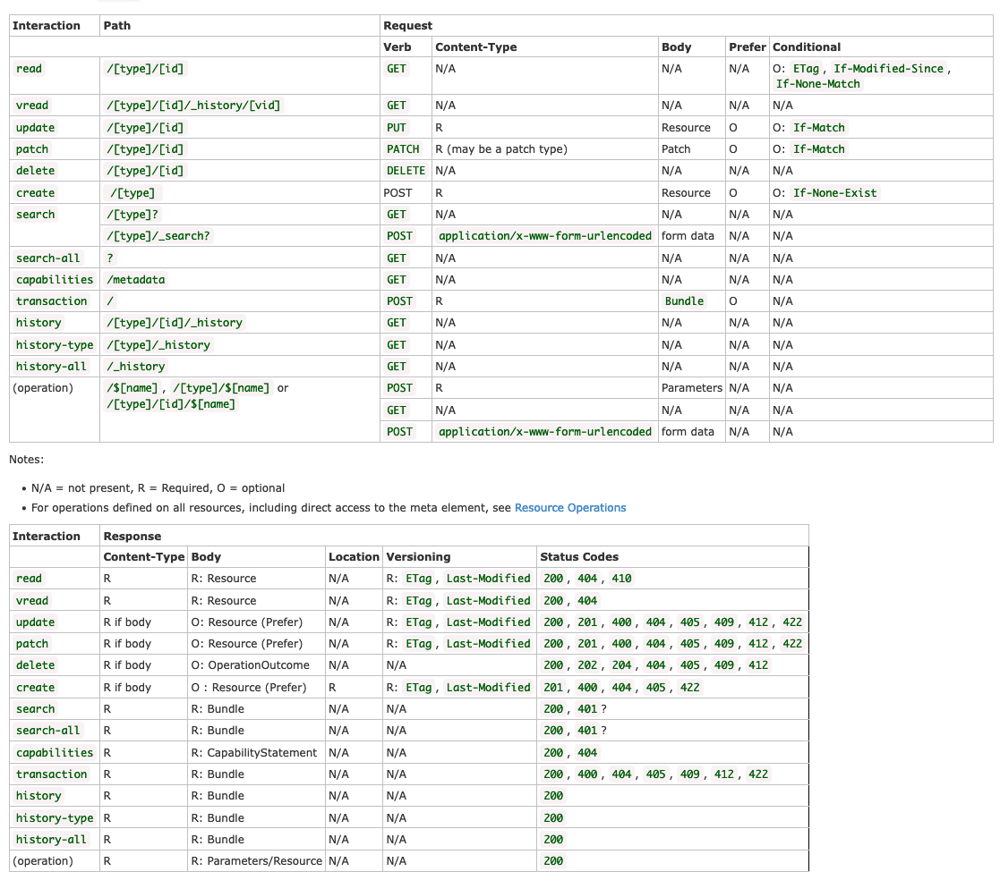

## Introduction

This notebook explores a FHIR server with a RESTful API which contains data with patients currently prescribed opioids.

## Initial setup

```{r setup}
library(fhircrackr)
library(tidyverse)
library(skimr)
library(summarytools)

# Used for direct RESTful queries against the FHIR server
library(httr)
library(jsonlite)

library(lubridate) # Datetime manipulation

# Visualizations
library(ggthemes)
theme_set(ggthemes::theme_economist_white())
```

## Environment configuration

```{r}
fhir_server <- "https://api.logicahealth.org/opioids/open"
```

## Querying the Server

All servers are required to support the `capabilities` interaction which documents the server's functionality. The capability interaction is of the form:

`GET [base]/metadata`

📘[Read more about the capabilities interaction](https://www.hl7.org/fhir/http.html#capabilities)

In Exercise 0, we used `fhircrackr` to pull data from the FHIR server into R. This works well for FHIR queries that return an instance of the [Bundle resource](http://www.hl7.org/fhir/bundle.html) (which is how FHIR servers package the responses to many queries). However, `GET [base]/metadata` returns an instance of [CapabilityStatement](http://hl7.org/fhir/capabilitystatement.html) so `fhircrackr` can't read it.

Instead, we can use the same approach used in the Python to directly query the FHIR server's RESTful interface and get a JSON response:

```{r}
response <- httr::GET(
        url = str_interp("${fhir_server}/metadata"),
        config = list(add_headers( Accept = 'application/fhir+json'))
)
str_c("HTTP Status Code: ", response$status_code)
```

The HTTP status code, `200 - OK` indicates a successful response. The CapabilityStatement is usually a very large resource so we'll focus on a few key elements.

```{r}
# Convert from raw `httr` response into an R list for easier access
response_list <- fromJSON(httr::content(response, as = "text", encoding = "UTF-8"), flatten = TRUE)

print(str_interp("FHIR Version Supported: ${response_list$fhirVersion}"))
print(str_interp("Formats Supported: ${paste(response_list$format, collapse = ', ')}"), quote = F)

print(str_interp("Number of RESTful Endpoints: ${dim(response_list$rest)[1]}"))
```
Endpoint type:
```{r}
response_list$rest %>% select(mode)
```

There is only a single server RESTful endpoint. We can also see the types of FHIR Resources available on this endpoint and the supported operations. Keep in mind that there might not be any data available for a particular FHIR resource even if the server supports that type.

Supported resources:

```{r}
df_resource <- response_list$rest$resource[[1]]
df_resource %>% select(type)
```

Interactions supported by Resource:

```{r}
df_resource %>%
        mutate(
                interaction = paste(interaction[[1]]$code, collapse = ", ")
        ) %>%
        select(type, interaction)
```

Searches supported by Resource:

```{r}
df_resource %>%
        mutate(
                searchParam = paste(searchParam[[1]]$name, collapse = ", ")
        ) %>%
        select(type, searchParam)
```

### Querying the Server

The FHIR Spec has a nice summary cheat sheet which is helpful for crafting queries and understanding the resources they return.



(Source: <https://www.hl7.org/fhir/http.html#summary>)

Now that we know a little bit about the server, let's query for all the patients.
```{r}
response <- httr::GET(
  url = str_interp("${fhir_server}/Patient"),
  config = list(add_headers( Accept = 'application/fhir+json'))
)

# Convert from raw `httr` response into an R list for easier access
response_list <- fromJSON(httr::content(response, as = "text", encoding = "UTF-8"), flatten = TRUE)

response_list$entry
```

You'll notice that this data frame contains nested data frames, which makes it more difficult to work with than we want. While this can be resolved by manipulating the data frames with R, using the `fhircrackr` package from Exercise 0 circumvents this complexity.

It also avoids the following complexity from the Python version of this exercise, as discussed in Exercise 0:

> Servers may paginate results when there are too many matches to reasonable return in a single request. Clients can provide a `_count` which suggests to the server how many resources to return in a Bundle. Servers are required to never provide more resources in a single bundle than a client requests with `_count`, but may provide less.
>
> 📘[Read more about the FHIR pagination](http://www.hl7.org/fhir/http.html#paging)
>
> 📘[Read more about `_count`](https://www.hl7.org/fhir/STU3/search.html#count)

To make the same query as above with `fhircrackr`, run the following:

```{r}
request <- fhir_url(url = fhir_server, resource = "Patient")
patient_bundle <- fhir_search(request = request)

# Identify which elements of the FHIR resource we want to capture in our data frame - see Exercise 0 for details
table_desc_patient <- fhir_table_description(
  resource = "Patient",

  cols = c(
    PID           = "id",
    given_name    = "name/given",
    family_name   = "name/family",
    gender        = "gender",
    birthday      = "birthDate",
    maritalStatus = "maritalStatus/coding[1]/code",
    maritalStatusDisplay = "maritalStatus/coding[1]/display"
  )

)

# Convert to R data frame
df_patient <- fhir_crack(bundles = patient_bundle, design = table_desc_patient, verbose = 0)

df_patient
```

From the `httr` approach, we can see the number of patients on the server:

```{r}
response_list$total
```

And we can see that we have all these patients the nice, [tidy](https://www.jstatsoft.org/article/view/v059i10) data frame thanks to `fhircrackr`:

```{r}
df_patient %>% skim
```


## Patient Demographics

Now that we have all our patients, let's try and analyze their demographics

```{r}
freq(df_patient, gender)
```


```{r}
freq(df_patient, maritalStatus)
```

The `M` and `S` codes are a bit cryptic, so let's check them against the display text:

```{r}
ctable(df_patient$maritalStatusDisplay, df_patient$maritalStatus)
```
It looks like there may be some data quality issues with this variable -- why does `maritalStatusDisplay` have both `Never Married` and `S` if those equate to the same code of `S`?

Histogram of patient ages:
```{r}
df_patient %>%
        mutate(
          # `%--%` creates an interval: https://lubridate.tidyverse.org/reference/interval.html
          # `/ years(1)` converts the interval into a number of years
          age = (lubridate::date(birthday) %--% lubridate::today()) / years(1)
        ) %>%
        ggplot(aes(age)) +
        geom_histogram()

```

TODO: not sure what to do with this from the Python version:

```
identifiers_table = patients_df[['id','identifier']]
identifiers_table.groupby('id').identifier.apply(lambda x: pd.DataFrame(x.values[0])).reset_index()
```

## Querying for Resources

FHIR breaks up health information into chunks of data called Resources which are connected together via references.

In this use case we're interested in patients who've been prescribed opioids. Looking at the [FHIR Patient profile](https://www.hl7.org/fhir/patient.html) we see a few references to things like their primary care provider or people that the organization managing the patient record, but nothing about medications. Luckily, above this profile we see a list of other resources that reference Patient - including [MedicationRequest](https://www.hl7.org/fhir/medicationrequest.html#MedicationRequest). Looking within MedicationRequest we see that `MedicationRequest.subject` identifies the patient the medication is for.

Let's see if we can find the Medications prescribed to the patient with id `10098`. The core FHIR spec doesn't require that any specific searches be supported so it's important to read the documentation and look at the CapabilityStatement of the server being queried to get an idea of the options available. For now we'll look at the core FHIR spec for an idea of search parameters defined in the base spec that servers might implement.

Looking at the MedicationRequest Resource core FHIR documentation it looks like there are two search parameters that would be helpful: `patient` and `subject`. Practically either would work just fine, but looking at the Expression we can see that `patient` only works for references to a Patient resource, while `subject` would work for references to either a Patient or a Group. Looking at the CapabilityStatement, it also appears that the server supports both!

_Note: Specific FHIR Implementation Guides, like US Core, may define their own SearchParameters for servers to implement_

📘[Read more about FHIR Resource Organization](https://www.hl7.org/fhir/overview-arch.html#organizing)

```{r}
# capabilities_df[capabilities_df['Resource']=='MedicationRequest'].explode('Search')[['Resource','Search']]

df_resource %>%
  mutate(
    searchParam = paste(searchParam[[1]]$name, collapse = ", ")
  ) %>%
  select(type, searchParam) %>%
  filter(type == "MedicationRequest")
```

Let's pull in the [MedicationRequest](https://hl7.org/fhir/medicationrequest.html) instances for one patient using the JSON approach -- this gives us an easy way to see which elements are provided by this server. You can also look at the [MedicationRequest spec](https://hl7.org/fhir/medicationrequest.html) to help determine which elements are populated.

```{r}
response <- httr::GET(
  url = str_interp("${fhir_server}/MedicationRequest?patient=10098"),
  config = list(add_headers( Accept = 'application/fhir+json'))
)

# Convert from raw `httr` response into an R list for easier access
response_list <- fromJSON(httr::content(response, as = "text", encoding = "UTF-8"), flatten = TRUE)

response_list$entry %>% glimpse
```

Now we can use `fhircrackr` to quickly load these into a data frame:

```{r}
request <- fhir_url(url = fhir_server, resource = "MedicationRequest", parameters = c(patient="10098"))
medication_request_bundle <- fhir_search(request = request)

# Identify which elements of the FHIR resource we want to capture in our data frame - see Exercise 0 for details
table_desc_medication_request <- fhir_table_description(
resource = "MedicationRequest",

cols = c(
patient = "subject/reference",
med_code_value = "medicationCodeableConcept/coding/code",
med_code_system = "medicationCodeableConcept/coding/system",
med_code_display = "medicationCodeableConcept/coding/display"
)

)

# Convert to R data frame
df_meds <- fhir_crack(bundles = medication_request_bundle, design = table_desc_medication_request, verbose = 0)

df_meds
```

Looks like this patient has been prescribed tramadol hydrocholoride (RXNorm `835603`). What if we want to know the brand name for our research or a SMART-on-FHIR app used by clinicians? Let's see if the RxNorm API can help. This is where we can look to other APIs!

Here's an API that might work: <https://lhncbc.nlm.nih.gov/RxNav/APIs/RxNormAPIs.html>

Looks like https://lhncbc.nlm.nih.gov/RxNav/APIs/api-RxNorm.getAllRelatedInfo.html will have what we need since I know I want the [Brand Name term type](https://www.nlm.nih.gov/research/umls/rxnorm/docs/appendix5.html)

```{r}
response <- httr::GET(
  url = str_interp("https://rxnav.nlm.nih.gov/REST/rxcui/835603/allrelated.json"),
  config = list(add_headers( Accept = 'application/json'))
)

# Convert from raw `httr` response into an R list for easier access
response_list <- fromJSON(httr::content(response, as = "text", encoding = "UTF-8"), flatten = TRUE)

response_list %>% glimpse
```

We can pull the brand names out of this:
```{r}
(response_list$allRelatedGroup$conceptGroup %>% filter(tty == "BN"))$conceptProperties[[1]]$name
```

What if we want to know the drug schedule?

That's in the [`getAllProperties` API](https://lhncbc.nlm.nih.gov/RxNav/APIs/api-RxNorm.getAllProperties.html)

```{r}
response <- httr::GET(
  url = str_interp("https://rxnav.nlm.nih.gov/REST/rxcui/835603/allProperties.json?prop=Attributes"),
  config = list(add_headers( Accept = 'application/json'))
)

# Convert from raw `httr` response into an R list for easier access
response_list <- fromJSON(httr::content(response, as = "text", encoding = "UTF-8"), flatten = TRUE)

response_list %>% glimpse
```

We can pull the schedule out of this:
```{r}
response_list$propConceptGroup$propConcept %>% filter(propName == "SCHEDULE")
```

Looks like it's Schedule 4. It's even listed as an example on the [FDA Drug Schedule website](https://www.dea.gov/drug-information/drug-scheduling)

What about what this drug treats?

```{r}
response <- httr::GET(
  url = str_interp("https://rxnav.nlm.nih.gov/REST/rxclass/class/byRxcui.json?rxcui=835603"),
  config = list(add_headers( Accept = 'application/json'))
)

# Convert from raw `httr` response into an R list for easier access
response_list <- fromJSON(httr::content(response, as = "text", encoding = "UTF-8"), flatten = TRUE)

response_list %>% glimpse
```
```{r}
response_list$rxclassDrugInfoList$rxclassDrugInfo %>% filter(rela == "may_treat") %>% select("minConcept.name", "rxclassMinConceptItem.className")
```

What about ATC class? This uses the same API as what the drug treats, so we can also pull that out of the same response.

```{r}
response_list$rxclassDrugInfoList$rxclassDrugInfo %>% filter(relaSource == "ATC") %>%
        select("minConcept.name", "rxclassMinConceptItem.className")
```

If we want to add the ATC class name to every medication for our patient, we can do this by defining a custom function that calls the API and extracts the first `className` value, and then applying this to each row in the `df_meds` data frame.
```{r}
fn_get_atc_class <- function(rxnorm) {
  print(str_interp("Getting ATC class for ${rxnorm}"))
  response <- httr::GET(
    url = str_interp("https://rxnav.nlm.nih.gov/REST/rxclass/class/byRxcui.json?rxcui=${rxnorm}"),
    config = list(add_headers( Accept = 'application/json'))
  )

  # Convert from raw `httr` response into an R list for easier access
  response_list <- fromJSON(httr::content(response, as = "text", encoding = "UTF-8"), flatten = TRUE)

  return((response_list$rxclassDrugInfoList$rxclassDrugInfo %>% filter(relaSource == "ATC"))[1,"rxclassMinConceptItem.className"])
}

# Test to make sure it works
fn_get_atc_class("835603")
```
Now apply this to each row in `df_meds` (we will actually only do the first 5 rows to save time):

```{r}
fn_get_atc_class_vectorized <- Vectorize(fn_get_atc_class)
df_meds %>%
        mutate(
          atc_class = fn_get_atc_class_vectorized(med_code_value)
        ) %>% 
  select(patient, med_code_value, atc_class, everything())
```
